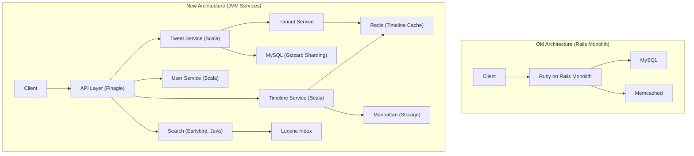
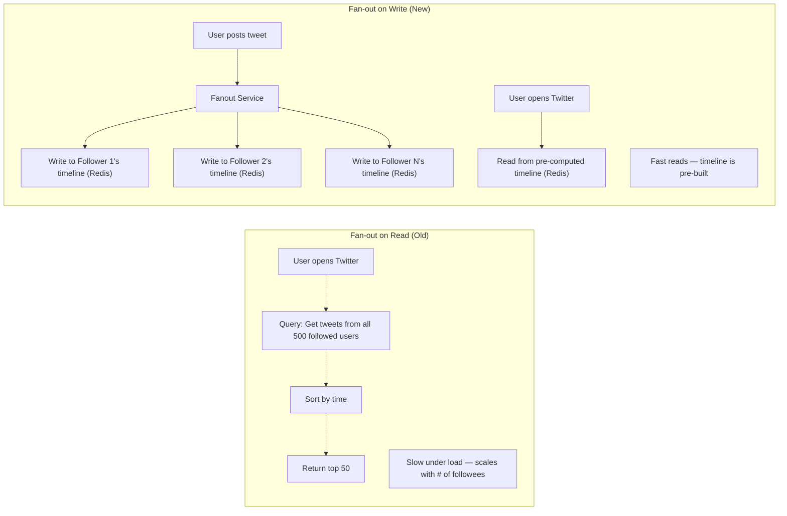

# Twitter's Fail Whale Era & Ruby to JVM Migration

Between 2007 and 2013, Twitter underwent one of the most dramatic engineering transformations in tech history. The platform went from a fragile Ruby on Rails monolith that crashed so frequently it earned an iconic error mascot — the Fail Whale — to a highly scalable JVM-based distributed system capable of handling hundreds of thousands of tweets per second and millions of timeline reads per second.

This is a story about what happens when a product grows orders of magnitude faster than its architecture can handle, and the multi-year engineering effort required to rebuild the foundations while keeping the service running.

## The Fail Whale Era (2007–2010)

### The Original Architecture

Twitter launched in 2006 as a Ruby on Rails monolith backed by a single MySQL database. The architecture was standard for a Web 2.0 startup:

- **Ruby on Rails** application handling all requests
- **MySQL** for data storage (tweets, users, follows, timelines)
- **Memcached** for caching
- A single monolithic codebase for the entire application

This architecture was perfectly reasonable for a small service. The problem was that Twitter did not stay small. The platform experienced explosive growth — from thousands of users in 2006 to tens of millions by 2008.

### What Went Wrong

The Fail Whale appeared so frequently between 2008 and 2010 that it became a cultural icon. Users created fan art, t-shirts, and memes. But behind the charming illustration was a serious engineering crisis:

::: danger What Was Failing
1. **Ruby's Global Interpreter Lock (GIL)**: Ruby MRI (the standard Ruby implementation) has a Global Interpreter Lock that prevents true parallel execution of Ruby threads. Under heavy load, this severely limited throughput per server.
2. **Monolith coupling**: Every feature — timeline generation, tweet posting, search, notifications — was in one codebase. A spike in any feature affected all features.
3. **Database bottleneck**: MySQL was a single point of failure and could not scale horizontally for the write patterns Twitter needed.
4. **Timeline fan-out**: Every tweet by a popular user needed to be delivered to millions of followers' timelines — a fundamentally hard distributed systems problem.
:::

### The Scale Challenge

To understand why Twitter struggled, consider the "timeline" problem:

```
User tweets "Hello world"

Fan-out computation:
  - User has 10 million followers
  - Each follower needs this tweet in their timeline
  - That's 10 million write operations per tweet
  - Popular users tweet 5-10 times per day
  - Multiple popular users tweeting simultaneously

Result: Millions of writes per second, just for timeline delivery
```

The original architecture computed timelines on read — when a user opened Twitter, the system would query for all tweets from everyone they followed, sort them by time, and return the result. This was:

```
Timeline read (fan-out on read):
  SELECT tweets.* FROM tweets
  JOIN follows ON tweets.user_id = follows.followed_id
  WHERE follows.follower_id = :current_user
  ORDER BY tweets.created_at DESC
  LIMIT 50;

  For a user following 500 accounts:
  → Scan tweets from 500 users
  → Sort and return top 50
  → Under load: 500ms–5000ms per request
  → With millions of concurrent users: collapse
```

### Notable Outages

Twitter experienced so many outages during this period that entire blog posts were dedicated to tracking them:

- **SXSW 2007**: Twitter's breakout moment at the SXSW conference coincided with massive outages as traffic spiked
- **2008 US Election**: Twitter experienced extended downtime during the 2008 presidential election as traffic surged
- **Michael Jackson's death (June 2009)**: Twitter reportedly handled 100,000+ tweets per minute about Michael Jackson, causing extended outages
- **2010 World Cup**: Major sporting events regularly brought Twitter down
- **General pattern**: Any global event that caused a spike in tweeting could bring down the entire platform

## The Migration (2010–2013)

### The Decision to Move Off Rails

By 2009, Twitter's engineering leadership recognized that incremental improvements to the Rails monolith were insufficient. They needed a fundamental architectural transformation:

1. **Decompose the monolith** into independent services
2. **Move compute-intensive services to the JVM** (Java/Scala) for better performance
3. **Pre-compute timelines** (fan-out on write) instead of computing them on read
4. **Build custom infrastructure** for Twitter's specific scale challenges

### New Architecture



### Key Components Built During Migration

**Finagle** (2011): An asynchronous RPC framework built on Netty, written in Scala. Finagle became the backbone of Twitter's service-to-service communication, providing:
- Connection pooling
- Load balancing
- Circuit breaking
- Timeout management
- Distributed tracing (via Zipkin, also built at Twitter)

**Manhattan** (2014): Twitter's custom distributed key-value store, replacing Cassandra for certain use cases. Manhattan was designed specifically for Twitter's access patterns.

**Earlybird** (2012): Twitter's real-time search engine, a custom Lucene-based system designed to index tweets within seconds of posting and handle Twitter's unique search patterns.

**Snowflake** (2010): A distributed ID generation system that created unique, roughly time-ordered IDs at scale. Snowflake IDs became a widely adopted pattern, used by Discord and many other companies.

```
Snowflake ID layout (64-bit):
| 1 bit: unused | 41 bits: timestamp | 5 bits: datacenter | 5 bits: worker | 12 bits: sequence |

  - Generates 4096 unique IDs per millisecond per worker
  - IDs are roughly time-ordered (good for database indexing)
  - No coordination needed between workers
```

**Gizzard** (2010): A middleware framework for partitioning and replicating data across multiple database backends. Gizzard allowed Twitter to shard MySQL across many servers while maintaining a consistent interface for application code.

### The Timeline Architecture Revolution

The most impactful change was switching from **fan-out on read** to **fan-out on write** for timelines:



**Fan-out on write** pre-computes timelines when a tweet is posted. Each follower's timeline in Redis is updated with the new tweet. When a user opens Twitter, their timeline is already built — just read from Redis.

The tradeoff: write amplification. A user with 10 million followers causes 10 million Redis writes per tweet. Twitter handled this with a hybrid approach:

- **Regular users**: Full fan-out on write
- **Celebrity users** (millions of followers): Mixed approach — fan-out on write to active followers, fan-out on read for inactive followers

::: tip What Saved Them
The decision to move timeline computation from read-time to write-time was the single most impactful architectural change. It transformed timeline reads from an expensive, variable-latency database operation into a simple, fast Redis cache read — reducing timeline read latency from seconds to low milliseconds.
:::

### The Scala Decision

Twitter chose Scala over Java as their primary JVM language for several reasons:

- **Functional programming features**: Better suited to concurrent, event-driven programming
- **Expressive type system**: Helped manage complexity in a large codebase
- **JVM compatibility**: Access to the Java ecosystem (Netty, Lucene, etc.)
- **Performance**: JVM's JIT compilation provided dramatically better throughput than Ruby MRI

The performance improvement was substantial:

```
Ruby on Rails (single server):
  Requests per second: ~200-400
  Memory per process: ~200-300 MB
  Concurrency: Limited by GIL

Scala + Finagle (single server):
  Requests per second: ~10,000-50,000
  Memory per JVM: ~500 MB-1 GB
  Concurrency: Full multi-core utilization

Result: 25-100x throughput improvement per server
```

## The Results

By 2013, Twitter had completed the core migration. The results were dramatic:

- **Fail Whale retirement**: The Fail Whale became a rare sight rather than a daily occurrence
- **Throughput**: From hundreds of requests per second to hundreds of thousands
- **Latency**: Timeline reads dropped from seconds to single-digit milliseconds
- **Reliability**: Twitter survived the 2012 election, the 2012 Olympics, and subsequent global events without the outages that had plagued earlier years
- **Developer velocity**: Independent services could be deployed independently, allowing faster iteration

## Lessons Learned

### 1. Language runtime matters at scale

::: danger Critical Insight
Ruby's GIL limited Twitter to one thread of execution per process. On a 32-core server, that meant 31 cores sitting idle during Ruby computation. Moving to the JVM — which supports true multi-threading — gave an immediate 25-100x throughput improvement. For CPU-bound, high-concurrency workloads, the language runtime's threading model is a fundamental constraint.
:::

### 2. Monolith to microservices is a multi-year journey

Twitter's migration took approximately 3 years (2010–2013) with a large, dedicated engineering team. The monolith was not decomposed all at once — services were extracted incrementally, starting with the most performance-critical paths (timeline, tweet storage, search).

### 3. Fan-out on read vs. fan-out on write is a fundamental design decision

The choice between computing results at read time (current, always fresh, but slow) versus pre-computing at write time (fast reads, but write amplification) is one of the most consequential architecture decisions in social platforms. Twitter's switch to fan-out on write was the key to solving their timeline scalability problem.

### 4. Build custom infrastructure for custom problems

Twitter built Finagle, Manhattan, Earlybird, Snowflake, and Gizzard — each solving a problem that no off-the-shelf solution could handle at Twitter's scale. The investment in custom infrastructure was enormous, but it gave Twitter precise control over performance characteristics.

### 5. The monolith is not the enemy — the wrong monolith is

Twitter's Rails monolith was not inherently bad. It was the wrong architecture for Twitter's specific scale and access patterns. A monolith in a language with good concurrency support, with proper data partitioning, could have lasted longer. The lesson is not "monoliths bad, microservices good" — it is "understand your constraints and choose architecture accordingly."

## What You Can Learn

1. **Understand your language runtime's concurrency model.** If your service is CPU-bound and high-concurrency, the language runtime's threading model matters enormously. Ruby's GIL, Python's GIL, and Node.js's single-threaded event loop all have different implications. See [Node.js Event Loop](/performance/optimization/nodejs-event-loop) for a deep dive.

2. **Choose fan-out on read vs. write deliberately.** For systems with asymmetric read/write patterns (like social feeds), decide early whether to compute at read time or write time. Fan-out on write trades storage and write amplification for fast reads.

3. **Plan the [migration from monolith](/architecture-patterns/microservices/migration-from-monolith) before you need it.** Twitter was forced to migrate under extreme pressure from constant outages. Starting a decomposition plan while the monolith is still functioning — but showing signs of strain — gives you more options and less risk.

4. **Invest in observability early.** Twitter built Zipkin (distributed tracing) during the migration. Understanding where latency lives in a distributed system is essential for both migration planning and ongoing operations.

5. **Custom infrastructure is a last resort, not a first choice.** Twitter built custom databases, RPC frameworks, and search engines because nothing else worked at their scale. For most companies, using existing tools (PostgreSQL, gRPC, Elasticsearch) is the right choice. Only build custom infrastructure when you have evidence that off-the-shelf solutions cannot meet your specific requirements.

---

*Sources: [Twitter Engineering Blog — The Infrastructure Behind Twitter: Scale](https://blog.twitter.com/engineering/en_us/a/2013/new-tweets-per-second-record-and-how) (2013); [Raffi Krikorian — Timelines at Scale](https://www.infoq.com/presentations/Twitter-Timeline-Scalability/) (QCon 2012); [Finagle: A Protocol-Agnostic RPC System](https://blog.twitter.com/engineering/en_us/a/2011/finagle-a-protocol-agnostic-rpc-system) (2011); [Twitter Engineering — Snowflake](https://blog.twitter.com/engineering/en_us/a/2010/announcing-snowflake) (2010); various Twitter engineering talks at Strange Loop, QCon, and Velocity.*
